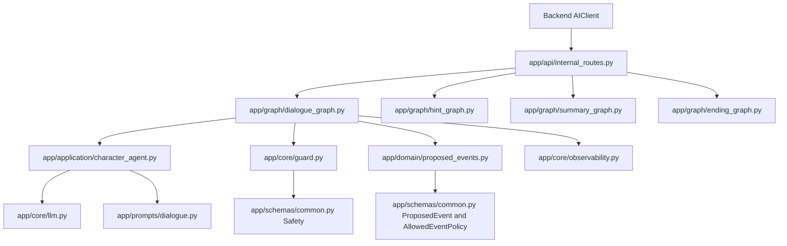
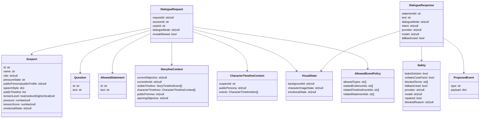
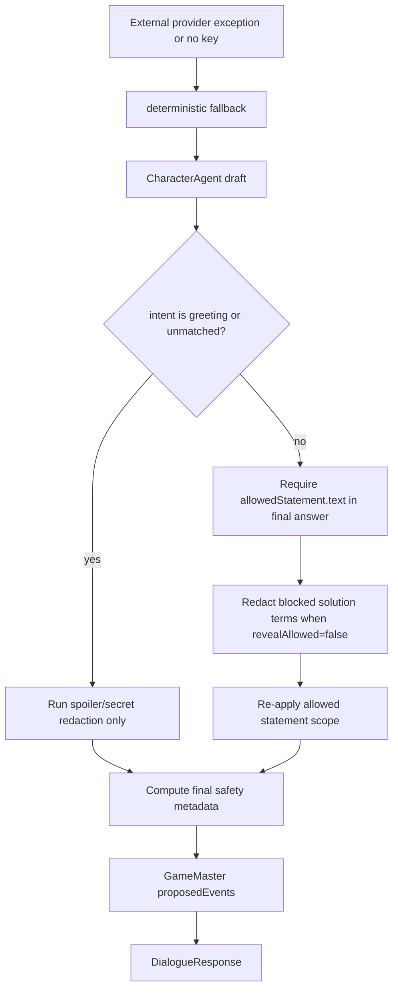
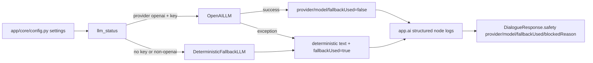
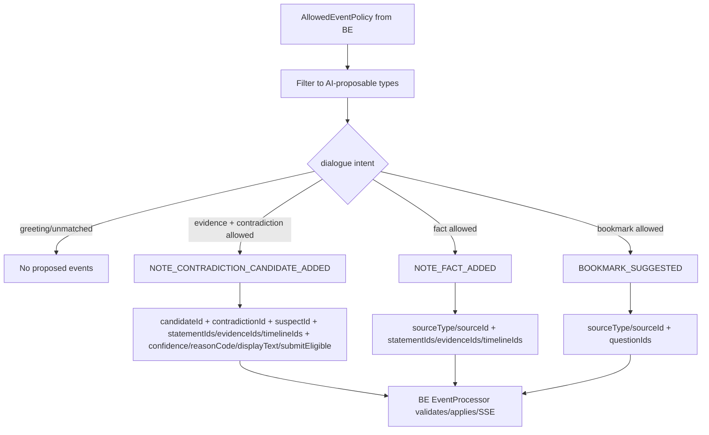

# AI Architecture and Model Structure

This document is the AI repo-local architecture/model map for future agents. Canonical cross-repo story contracts belong to `../Docs/*`; if this file conflicts with canonical DOCS output, update this file after DOCS acceptance.

## Scope and authority

The AI service is an internal generation and policy service. It does not own session state, evidence unlocks, pressure changes, verdicts, or SSE persistence.

- AI receives only Backend-supplied public payload data.
- AI generates character text, safety metadata, and `proposedEvents[]`.
- Backend validates/applies proposed events through EventProcessor and emits SSE.
- Hidden/private fields are accepted only for compatibility and must not influence output.

## Module graph



## Dialogue endpoint pipeline

```mermaid
sequenceDiagram
    participant BE as Backend AIClient
    participant API as POST /internal/v1/dialogue/respond
    participant Schema as DialogueRequest
    participant Context as load_context/validate_scope
    participant CA as CharacterAgent
    participant LRC as LightRuleCheck
    participant GM as GameMasterAgent
    participant Resp as DialogueResponse

    BE->>API: public dialogue payload
    API->>Schema: Pydantic parse, extras allowed
    Schema->>Context: allowedStatement, suspect, visualState, storyline, event policy
    Context->>CA: public context only
    CA->>CA: classify dialogueMode/question intent
    CA->>CA: render persona/tension/emotion-grounded seed
    CA->>LRC: draft text + provider/fallback metadata
    LRC->>LRC: redacts solution terms; repairs to allowed facts when needed
    LRC->>GM: final safe text and safety metadata
    GM->>GM: propose allowlisted events with stable visible IDs only
    GM->>Resp: text, visualState, proposedEvents, safety, provider/fallback metadata
    Resp-->>BE: Backend validates/applies events; AI does not mutate state
```

## Dialogue schema relationships



## Safety, repair, and fallback flow



Safety metadata describes the final emitted text, not only the first draft. `LightRuleCheck` must conservatively repair or redact when a provider adds case facts, hidden truth, culprit/motive/weapon, or private fields.

## Provider/fallback observability flow



Structured logs are emitted for `load_context`, `validate_scope`, `CharacterAgent`, `LightRuleCheck`, `GameMasterAgent`, and `format_response`. Logs include IDs and metadata, not hidden case facts or full prompts.

## Data consumption rules

### Persona, speech style, public timeline, and tension

`CharacterAgent` currently consumes:

- `suspect.publicPersona`, also accepted from BE alias `suspect.publicProfile`, for cautious/persona-aware phrasing.
- `suspect.speechStyle` as optional short surface style hints. Only small safe values such as `tic` or `prefix` are used; arbitrary style content must not add facts.
- `suspect.tensionLevel` as the canonical visual/dialogue label (`low|medium|high|critical`).
- `suspect.pressure` and optional `suspect.tensionScore` as numeric intensity signals for tense/pressed phrasing.
- `storyline.currentActId` for broad act-level pressure/tone only.
- `question.text` and optional `dialogueMode` for deterministic intent classification.
- `allowedStatement.id/text` as the only authoritative dialogue fact.
- `allowedEventPolicy.allowedTypes` and related public IDs for `proposedEvents[]`.

`publicTimeline`, `storyline.visibleTimeline`, `visibleFacts`, and `characterTimeline.events` are accepted and preserved in schemas. Canonical DOCS decision: `characterTimelines[]` is first-class case data, and `suspects[].publicTimeline` is a BE-filtered public projection from `characterTimelines[].publicEvents`. These fields may shape tone/context, and may ground factual text only when referenced by `allowedStatement.sourceRefs` or `allowedEventPolicy` stable IDs. `allowedStatement.text` remains the default factual anchor.

### Visible facts and revealAllowed=false

When `revealAllowed=false`:

- Block/redact direct solution/culprit/motive/weapon terms.
- Ignore `secret`, `solution`, `isCulprit`, `hiddenTruth`, `privateTimeline`, `privateMotive`, `actualAction`, `isLie`, `secretNote`, and similar extras.
- Do not emit proposed event payloads derived from hidden/private fields.
- Use `allowedStatement.text` and stable visible IDs as the safe factual boundary.

## Proposed events policy



AI never proposes authoritative mutation events such as evidence unlock, visual-state changes, tension changes, pressure changes, or verdict changes. Backend remains the only authority for applying proposed events and running idempotent tension policy after validated contradictions.

## Public vs hidden fields

| Category | Examples | AI use |
| --- | --- | --- |
| Public identity/style | `suspect.id`, `name`, `role`, `publicProfile/publicPersona`, `speechStyle` | Tone/persona only |
| Public state | `pressureState`, `tensionLevel`, `emotionalState`, `visualState` | Tone/metadata; no state mutation |
| Public facts | `allowedStatement.id/text`, visible timeline IDs, related evidence/statement IDs | Dialogue fact boundary and event references |
| Story context | `storyline.currentActId`, `currentObjective`, visible public timelines | Tone/objective context; not hidden truth |
| Hidden/private extras | `secret`, `solution`, `isCulprit`, `privateMotive`, `privateTimeline`, `actualAction`, `isLie`, `secretNote` | Must be ignored/redacted; never logged or emitted |

## Canonical DOCS decisions applied

1. `suspect.tensionLevel` is a label string: `low|medium|high|critical`. Numeric intensity comes from `suspect.pressure` and optional `suspect.tensionScore`; AI runtime schemas accept this shape.
2. `characterTimelines[]` is first-class case data. `suspects[].publicTimeline` is a BE-filtered public projection from `characterTimelines[].publicEvents`, not weak matching against global timeline source IDs.
3. `speechStyle` and `tensionProfile` belong in BE case data after migration. AI receives only the BE-projected public payload and must treat arbitrary style content as tone only, not as new facts.
4. `allowedStatement` remains the factual anchor. `publicTimeline`/`visibleFacts` may shape tone/context and may ground factual text only when referenced by `allowedStatement.sourceRefs` or `allowedEventPolicy` stable IDs.
5. Contradiction candidates use canonical payload fields: `candidateId`, `contradictionId`, `suspectId`, `statementIds`, `evidenceIds`, `timelineIds`, `confidence`, `reasonCode`, `displayText`, and `submitEligible`. BE still validates/regenerates public text.
6. Visual expression values are canonicalized by DOCS/FE as `neutral`, `wary`, `defensive`, `angry`, `anxious`, `shocked`, `breakdown`, `confident_lying`, `sad`, and `focused`. Provider/fallback/safety/event IDs are MVP developer diagnostics, not polished player-facing UI.

## Remaining migration gaps to route through DOCS/BE/FE

1. BE should send the full target AI payload consistently: `currentObjective`/`storyline`, `characterTimeline`, `visualState`, and `allowedEventPolicy` with stable IDs.
2. AI currently keeps factual text conservative: public timeline facts do not expand dialogue unless they are tied to `allowedStatement.sourceRefs` or `allowedEventPolicy` references.
3. FE/BE visual precedence is canonicalized as immediate HTTP visualState with newer BE session/SSE events winning; E2E runtime validation must confirm this outside the AI repo.
4. Overall MVP remains blocked until runtime gates in `../Docs/story-validation-gates.md` pass across BE/AI/FE.

## Validation commands

Minimum validation after runtime AI changes:

```bash
pytest -q
python -m compileall app tests
```

After runtime changes are intended for integration dogfood, rebuild/recreate at least the AI container and verify:

```bash
docker compose up -d --build ai backend
curl -fsS http://127.0.0.1:8001/health
curl -fsS http://127.0.0.1:8000/api/v1/health
curl -fsS http://127.0.0.1:8080/api/v1/health
```
