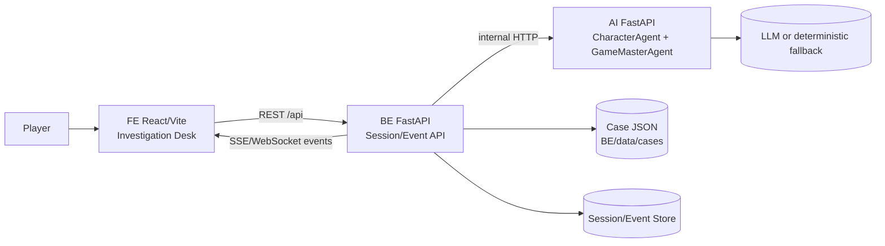
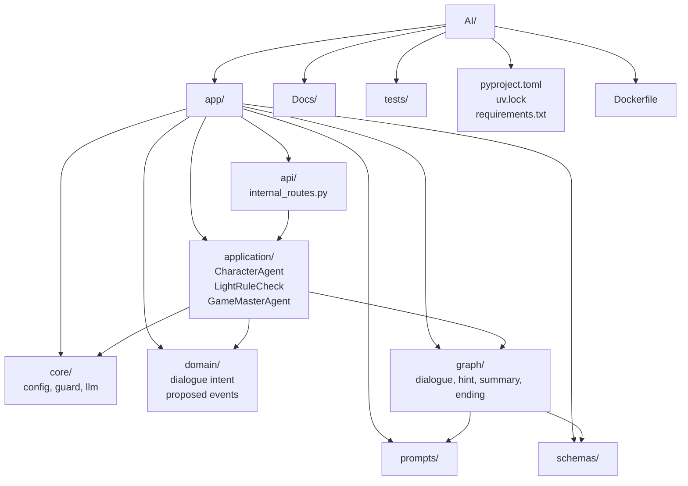
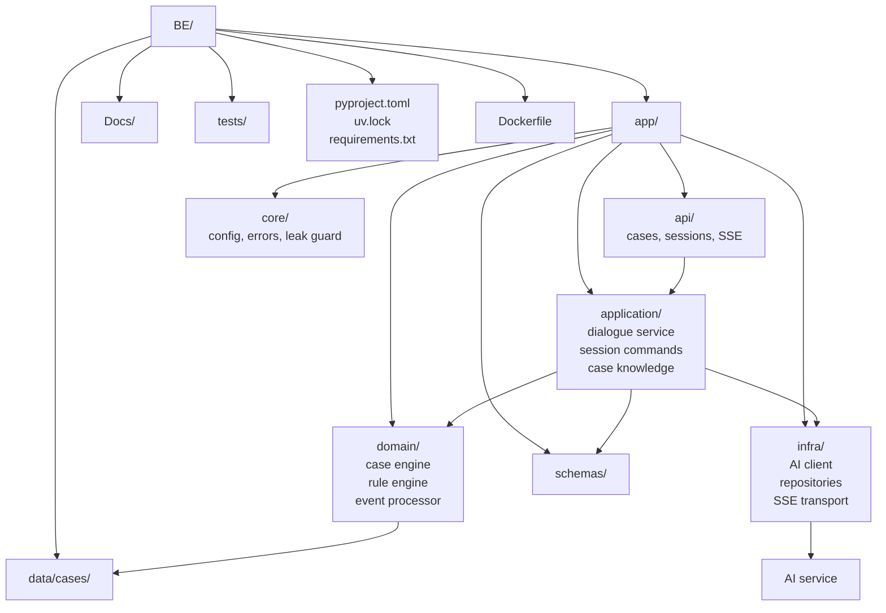
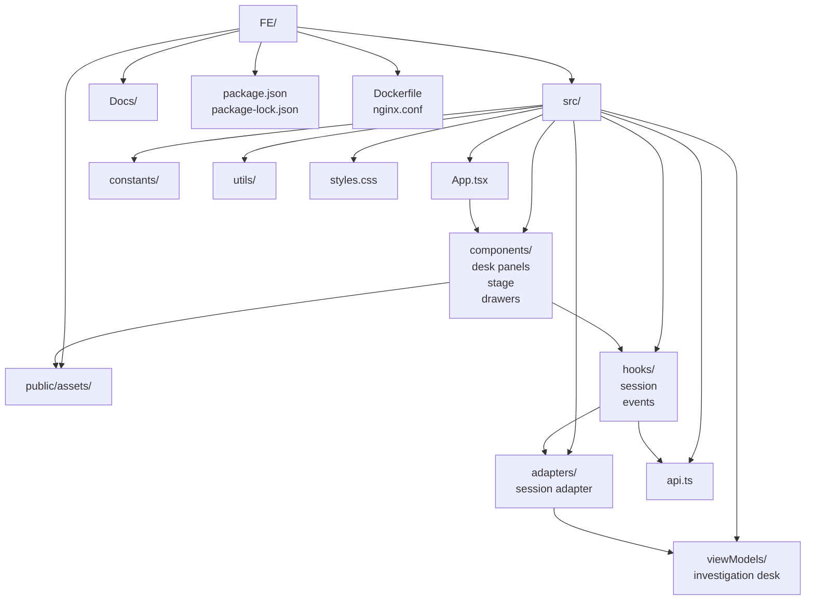
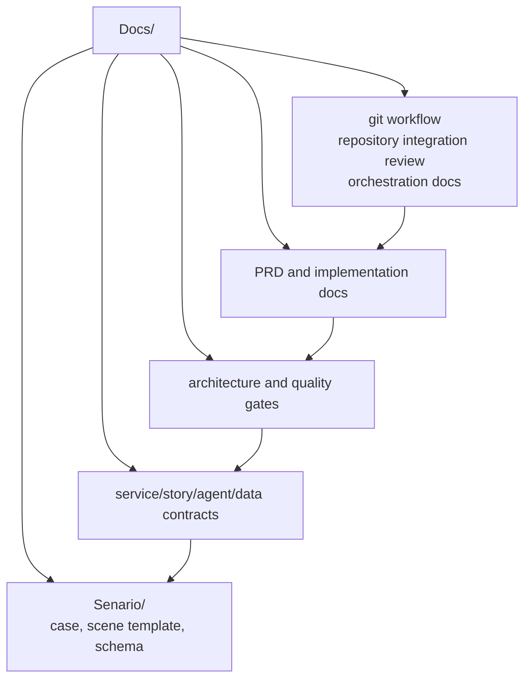
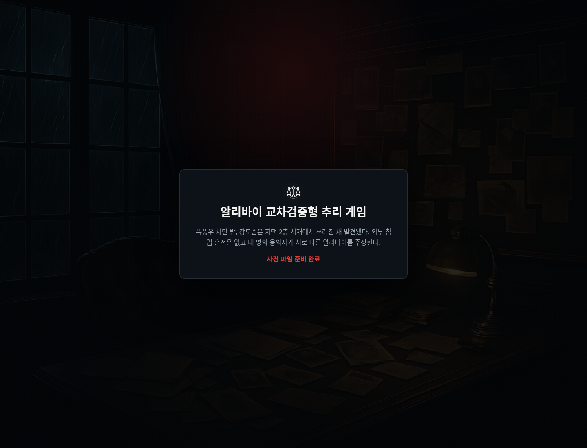

# Detective Agent

PRD 기반 대화형 알리바이 교차검증 추리 게임 MVP입니다. 사용자는 수사 데스크 UI에서 용의자와 대화하고, 증거와 진술을 비교해 모순을 제기한 뒤 최종 범인을 지목합니다.

## 핵심 목표

- 사건 1개, 용의자 4명 이상, 증거/기록 8개 이상을 제공한다.
- 제한 대화 12회 안에서 자연어 질문, 대화 기록, 추리 노트, 증거/기록/관계 탭을 제공한다.
- 진술과 증거를 기반으로 모순 제기 및 정답/부분/근거부족/오답 판정을 수행한다.
- AI 실패 시에도 deterministic rule engine으로 게임 진행을 유지한다.
- GameMasterAgent가 제안한 수첩/증거/visualState 변경은 Backend Event Processor 검증 후 UI에 반영한다.

## 서비스 구성



- `FE`: React/Vite 기반 단일 화면 수사 데스크, nginx 정적 서빙
- `BE`: FastAPI Backend API, deterministic rule engine, Event Processor, 세션/이벤트 저장
- `AI`: FastAPI AI 보조 서비스, CharacterAgent -> LightRuleCheck -> GameMasterAgent 구조
- `Docs`: 시나리오, 계약, 아키텍처, 운영/리뷰 문서

## 저장소 구조

```text
.
├── AI/                  # AI 보조 서비스
│   ├── app/api/         # 내부 API 라우트
│   ├── app/application/ # CharacterAgent, GameMasterAgent, rule check
│   ├── app/graph/       # dialogue, hint, summary, ending graph
│   ├── app/prompts/     # 프롬프트 템플릿
│   ├── app/schemas/     # AI 요청/응답 스키마
│   └── tests/           # AI 서비스 테스트
├── BE/                  # Backend API 서비스
│   ├── app/api/         # cases, sessions, SSE 라우트
│   ├── app/application/ # 세션 명령, 대화 서비스, 사건 지식 서비스
│   ├── app/domain/      # 사건 엔진, 이벤트 처리, 룰 엔진
│   ├── app/infra/       # AI client, repository, transport
│   ├── app/schemas/     # 공개 API 스키마
│   └── data/cases/      # 사건 JSON 데이터
├── FE/                  # Frontend 앱
│   ├── public/assets/   # 캐릭터/증거/배경 에셋
│   ├── src/components/  # 수사 데스크 UI 컴포넌트
│   ├── src/hooks/       # 세션/이벤트 훅
│   ├── src/viewModels/  # 화면용 상태 조립
│   └── src/adapters/    # API 응답 어댑터
├── Docs/                # 제품/구조/운영 문서
├── PRD.md               # MVP 요구사항
├── docker-compose.yml   # 3개 서비스 로컬 실행
└── scripts/             # 보조 스크립트
```

## 각 레포 구조 시각화

### AI



AI 서비스는 Backend가 전달한 공개 컨텍스트 안에서만 자연어 답변과 공개 가능한 proposed events를 만든다. 최종 판정과 상태 변경 권한은 Backend에 있다.

### BE



Backend는 세션, 질문 소모, 모순 판정, unlock, 이벤트 저장/발행의 단일 진실 공급원이다. AI 응답은 Backend 검증을 통과한 뒤에만 세션 상태에 반영된다.

### FE



Frontend는 조사 데스크 경험을 구성하고, Backend 세션 payload와 SSE/WebSocket 이벤트를 화면 상태로 변환한다. 로컬 mock data는 개발 보조용이며 실제 게임 진행의 기준은 Backend 응답이다.

### Docs



문서는 제품 요구사항, 시나리오 데이터 계약, 서비스 계약, 운영 절차를 연결한다. 코드 변경으로 API, 이벤트, 데이터 구조, 운영 방식이 바뀌면 관련 문서를 같은 PR에서 갱신한다.

## Docker 실행 화면

Docker Compose로 실행한 메인 페이지입니다. 스크린샷은 1440x1100 viewport의 깨끗한 브라우저 프로필에서 캡처했습니다.



## 로컬 실행

```bash
docker compose up --build
```

접속:

- Frontend: http://localhost:8080
- Backend health: http://localhost:8000/api/v1/health
- AI health: http://localhost:8001/health

Frontend 컨테이너는 `/api/` 요청을 `http://backend:8000`으로 프록시합니다. Backend는 `BE_AI_SERVICE_BASE_URL=http://ai:8001`로 AI service를 호출합니다.

## 개별 검증

```bash
cd AI && uv sync && uv run pytest -q
cd ../BE && uv sync && uv run pytest -q
cd ../FE && npm run build
```

루트에서 Frontend 빌드만 실행할 수도 있습니다.

```bash
npm run build
```

## 주요 문서

- [PRD.md](PRD.md): 제품 요구사항과 MVP 범위
- [Docs/git-workflow.md](Docs/git-workflow.md): Issue, 브랜치, 최소 커밋, PR, merge, 리뷰 절차
- [Docs/repository-integration-review.md](Docs/repository-integration-review.md): 루트 저장소 통합 검토 기록
- [Docs/implementation-overview.md](Docs/implementation-overview.md): 구현 개요
- [Docs/final-scenario-and-event-architecture.md](Docs/final-scenario-and-event-architecture.md): 시나리오와 이벤트 아키텍처
- [Docs/service-contract-dialogue-story.md](Docs/service-contract-dialogue-story.md): 대화/스토리 서비스 계약
- [Docs/structure-audit.md](Docs/structure-audit.md): 구조 점검 기록

## Git 운영

루트 디렉터리 하나만 Git 저장소로 사용합니다. `AI/`, `BE/`, `FE/`, `Docs/` 내부에 별도 `.git`을 두지 않습니다.

기본 통합 브랜치는 `dev`입니다.

```text
feature/*, fix/*, docs/* -> PR -> dev -> release PR -> main
```

작업 원칙:

- Issue 하나를 기준으로 작업 브랜치를 만든다.
- 커밋은 리뷰 가능한 최소 단위로 나눈다.
- 모든 변경사항은 PR 리뷰를 거쳐 `dev`에 merge한다.
- 안정화된 `dev`만 `main`으로 승격한다.

자세한 절차는 [Docs/git-workflow.md](Docs/git-workflow.md)를 따릅니다.
