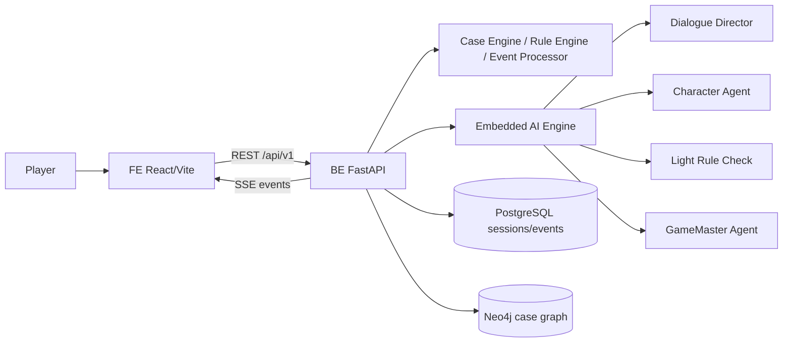

# Detective Agent

자연어 심문과 증거 교차검증으로 알리바이의 모순을 찾는 웹 기반 추리 게임 MVP입니다.

현재 코드는 `FE` React/Vite 앱과 `BE` FastAPI 앱을 중심으로 동작합니다. 문서는 방향성과 계약을 설명하지만, 실행 가능한 기준은 코드베이스와 테스트입니다.

## 한 줄 요약

플레이어는 한 화면의 수사 데스크에서 용의자를 심문하고, 대화 로그·증거·기록·관계도를 확인한 뒤, 진술과 증거의 충돌을 근거로 최종 범인을 지목합니다.

## 현재 구현 범위

| 영역 | 구현 상태 |
| --- | --- |
| Frontend | React 19 + Vite SPA. 사건 목록, 사건 상세, 수사 데스크, Agent Logger 화면 제공 |
| Backend | FastAPI. 사건/세션 API, 자연어 대화 제출, 모순 판정, 노트/북마크, 최종 지목, SSE 이벤트 제공 |
| AI Engine | `BE/app/ai_engine` 내부 통합. CharacterAgent, DialogueDirector, LightRuleCheck, GameMasterAgent, hint/summary/ending graph 포함 |
| Persistence | PostgreSQL 세션/이벤트 저장, Neo4j 사건 지식 그래프 연동, 파일 기반 사건 JSON seed |
| Runtime | Docker Compose로 frontend, backend, postgres, neo4j 실행 |
| Validation | BE pytest, FE TypeScript/Vite build, FE smoke scripts |

## 플레이 루프

1. 사건을 선택하고 새 세션을 시작한다.
2. 수사 데스크에서 용의자를 선택한다.
3. 자연어로 질문을 입력한다.
4. Backend가 질문을 공개 사건 상태와 용의자 컨텍스트에 매핑한다.
5. AI Engine이 캐릭터 답변을 만들고 LightRuleCheck가 품질/안전성을 검사한다.
6. Rule Engine과 Event Processor가 대화 결과, 모순, 해금, 노트 후보를 검증한다.
7. FE는 HTTP 응답과 SSE 이벤트를 받아 대화 로그, 증거, 노트, 긴장도, visualState를 갱신한다.
8. 플레이어는 진술과 증거의 충돌을 제기하고 최종 범인을 지목한다.

## 아키텍처



핵심 원칙:

- FE는 AI를 직접 호출하지 않는다.
- FE 화면 상태는 Backend 세션 payload와 SSE 이벤트에서 파생한다.
- 정답 판정, 해금, 질문 소모, 압박 수치 변경은 Backend Rule Engine/Event Processor가 결정한다.
- AI Engine은 캐릭터 대화, 요약, 힌트, 엔딩 설명을 보조하되 판정을 덮어쓰지 않는다.
- 공개 API payload에는 `secret`, `isCulprit`, private motive/action 같은 비공개 사건 정보를 싣지 않는다.

## 저장소 구조

```text
.
├── BE/
│   ├── app/
│   │   ├── api/              # FastAPI routes: cases, sessions, SSE, agent logs
│   │   ├── application/      # session commands, dialogue service, ports
│   │   ├── domain/           # case engine, rule engine, event processor, models
│   │   ├── infra/            # DB, repositories, Neo4j, local AI client
│   │   ├── ai_engine/        # embedded agent graph/prompt/schema/runtime
│   │   ├── schemas/          # public request/response schemas
│   │   └── core/             # config, errors, logging, guards
│   ├── data/cases/           # case JSON seed data
│   ├── tests/                # backend unit/smoke/regression tests
│   ├── Docs/                 # backend implementation notes
│   ├── pyproject.toml
│   └── Dockerfile
├── FE/
│   ├── src/
│   │   ├── pages/            # case list/detail, session desk, logger pages
│   │   ├── components/       # investigation desk panels and UI widgets
│   │   ├── hooks/            # cases/session/events/agent-log hooks
│   │   ├── adapters/         # backend payload normalization
│   │   ├── viewModels/       # screen-ready investigation state
│   │   ├── utils/            # observability and public diagnostics
│   │   ├── api.ts            # REST/SSE URL client surface
│   │   └── storage.ts        # session recovery persistence
│   ├── public/assets/        # character, evidence, background assets
│   ├── Docs/                 # frontend implementation notes
│   ├── package.json
│   └── Dockerfile
├── Docs/                     # product, story, contract, architecture, operations docs
├── PRD.md                    # product requirements
├── docker-compose.yml        # local full-stack runtime
├── package.json              # root FE convenience scripts
└── README.md
```

## 주요 화면

| URL | 설명 |
| --- | --- |
| `/cases` | 사건 목록 |
| `/cases/:caseId` | 사건 상세 및 세션 시작 |
| `/sessions/:sessionId` | 메인 수사 데스크 |
| `/logger` | Agent Logger 디버그 화면 (`BE_DEBUG_TOOLS_ENABLED=true`) |

Docker Compose 기준 접속 주소:

- Frontend: http://localhost:8080
- Backend health: http://localhost:8000/api/v1/health
- Backend ready: http://localhost:8000/api/v1/ready
- Neo4j browser: http://localhost:7474

Frontend 개발 서버 기준 기본 주소는 http://localhost:5173 입니다.

## 주요 API

Backend prefix는 `/api/v1`입니다.

| Method | Path | 설명 |
| --- | --- | --- |
| GET | `/health` | Backend health check |
| GET | `/ready` | Backend + AI Engine readiness |
| GET | `/cases` | 사건 목록 |
| GET | `/cases/{caseId}` | 사건 상세 공개 payload |
| POST | `/sessions` | 새 세션 생성 |
| GET | `/sessions/{sessionId}` | 세션 조회 |
| POST | `/sessions/{sessionId}/dialogue` | 자연어 심문/모순 발화 제출 |
| POST | `/sessions/{sessionId}/questions` | 기존 questionId 기반 호환 API |
| GET | `/sessions/{sessionId}/events` | SSE 세션 이벤트 스트림 |
| GET/POST/PUT/DELETE | `/sessions/{sessionId}/notes` | 노트 조회/생성/수정/삭제 |
| POST | `/sessions/{sessionId}/bookmarks` | 북마크 생성 |
| GET | `/sessions/{sessionId}/hint` | 현재 상태 기반 힌트 |
| GET | `/sessions/{sessionId}/summary` | 세션 요약 |
| POST | `/sessions/{sessionId}/notes/summary` | 노트 요약 |
| POST | `/sessions/{sessionId}/accusation` | 최종 범인 지목 |
| GET | `/agent-logs` | Agent Logger 조회 |

Debug API는 `BE_DEBUG_TOOLS_ENABLED=true`일 때만 사용합니다.

- `POST /api/v1/sessions/{sessionId}/debug/pressure`
- `POST /api/v1/sessions/{sessionId}/debug/unlock`

## 로컬 실행

### 1. 전체 스택 실행

```bash
docker compose up --build
```

`docker-compose.yml`은 다음 서비스를 띄웁니다.

- `frontend`: nginx 정적 서빙, `/api/`를 backend로 proxy
- `backend`: FastAPI + embedded AI Engine
- `postgres`: 세션/이벤트 저장
- `neo4j`: 사건 지식 그래프

Backend 컨테이너는 `./.secret/.env`를 `env_file`로 읽습니다. 로컬에 파일이 없으면 생성한 뒤 필요한 `AI_*` 또는 provider key 값을 넣어야 합니다. AI 설정이 없거나 실패하면 readiness가 degraded가 될 수 있습니다.

### 2. Frontend 단독 개발

```bash
npm run install:fe
npm run dev
```

또는 FE 디렉터리에서 직접 실행합니다.

```bash
cd FE
npm install
npm run dev
```

기본 API base는 동일 origin입니다. 별도 Backend를 붙일 때는 `VITE_API_BASE_URL`을 설정합니다.

### 3. Backend 단독 개발

```bash
cd BE
uv sync
uv run uvicorn app.main:app --reload --host 0.0.0.0 --port 8000
```

주요 환경 변수:

| 변수 | 설명 | 기본값 |
| --- | --- | --- |
| `BE_API_PREFIX` | API prefix | `/api/v1` |
| `BE_DATABASE_URL` | PostgreSQL 연결 URL | 없음 |
| `BE_NEO4J_URI` | Neo4j bolt URL | 없음 |
| `BE_NEO4J_USER` | Neo4j 사용자 | `neo4j` |
| `BE_NEO4J_PASSWORD` | Neo4j 비밀번호 | `detective_secret` |
| `BE_DEBUG_TOOLS_ENABLED` | debug endpoints/logger 활성화 | `false` |
| `AI_LLM_PROVIDER` | AI provider | provider 설정에 따름 |
| `AI_MODEL_NAME`, `AI_TONE_MODEL_NAME` | 모델명 | provider 설정에 따름 |

## 검증

전체 변경 전후에 최소 다음 명령을 확인합니다.

```bash
# Frontend build
npm run build

# Backend tests
cd BE
uv run pytest -q
```

FE smoke script:

```bash
cd FE
npm run smoke:contracts
npm run smoke:public-diagnostics
npm run smoke:dialogue-repetition
npm run smoke:ending-ui
```

Docker runtime 변경 후에는 컨테이너를 다시 빌드/재생성하고 브라우저에서 `http://127.0.0.1:8080/`이 새 bundle을 반영하는지 확인합니다.

## 문서 지도

| 문서 | 용도 |
| --- | --- |
| `PRD.md` | 제품 목표, 사용자 여정, MVP 요구사항 |
| `Docs/implementation-overview.md` | FE/BE 실행 단위와 핵심 구현 원칙 |
| `FE/Docs/implementation.md` | FE 화면, 상태 모델, API/Event 연동 |
| `BE/Docs/implementation.md` | BE 책임, API, 도메인 규칙, 응답 계약 |
| `Docs/service-contract-dialogue-story.md` | 대화/스토리 서비스 계약 |
| `Docs/story-data-contract.md` | 사건 데이터 공개/비공개 계약 |
| `Docs/story-agent-contract.md` | Story/Agent 책임 경계 |
| `Docs/story-knowledge-wiki-contract.md` | CaseWiki/knowledge pack 계약 |
| `Docs/final-scenario-and-event-architecture.md` | 시나리오와 이벤트 아키텍처 |
| `Docs/structure-audit.md` | PRD 대비 구조 점검 기록 |
| `Docs/architecture-quality-gates.md` | 아키텍처 품질 게이트 |
| `Docs/docker-refresh-policy.md` | Docker refresh 기준 |
| `Docs/git-workflow.md` | branch, commit, PR 운영 규칙 |

## Git 운영

- 루트 디렉터리 하나만 Git 저장소로 사용합니다.
- 기본 통합 브랜치는 `dev`입니다.
- 기능/수정/문서 변경은 `feature/*`, `fix/*`, `docs/*` 등 작업 브랜치에서 PR을 거쳐 `dev`에 병합합니다.
- 커밋은 리뷰 가능한 최소 단위로 나눕니다.
- 자세한 절차는 `Docs/git-workflow.md`를 따릅니다.

## 현재 MVP에서 특히 중요한 경계

- 자연어 입력이 기본 플레이 방식이며, 추천 질문은 강제 선택지가 아니라 보조 힌트입니다.
- 모순 판정은 `/dialogue`에서 플레이어 발화가 공개 진술/증거 조합으로 매핑될 때 deterministic Rule Engine이 처리합니다.
- GameMasterAgent는 이벤트를 제안할 수 있지만 세션 상태를 직접 변경하지 않습니다.
- `TENSION_CHANGED`, `EVIDENCE_UNLOCKED`, `NOTE_*`, `VISUAL_STATE_CHANGED` 같은 이벤트는 Backend 검증 후 SSE로 발행됩니다.
- Frontend fallback은 게임 진행의 진실이 아닙니다. API 실패 시 로컬로 정답/해금/질문 소모를 꾸며내지 않아야 합니다.
