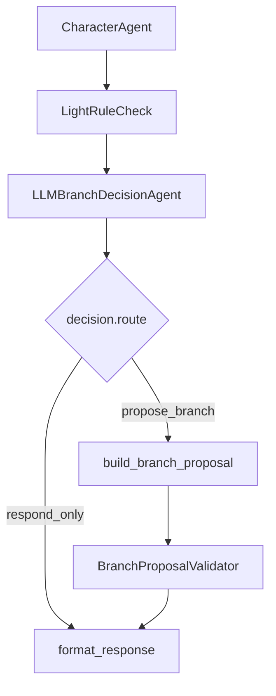

# LLM Branch Owner A-lite 제안: `respond_only` / `propose_branch`

## 0. 이번 문서의 결론

이 문서는 기존 피드백을 너무 큰 구조로 풀지 않고, 최소 변경으로 “LLM이 branch owner처럼 보이는” A-lite 방향을 정리한다.

받은 피드백:

> LLM이 대사 생성/문체 보정에만 제한되고, 게임 상태·증거 unlock·판정 등 권위 있는 분기는 백엔드 결정론 정책이 소유한다.

이번 A-lite에서는 LLM에게 바로 `unlock`, `contradiction 확정`, `pressure 상승`, `final verdict` 같은 권위 있는 상태 권한을 넘기지 않는다.  
대신 LLM이 **현재 턴에서 그냥 답변만 할지, 플레이어가 헤매는 흐름이므로 다음 수사 방향을 제안할지**를 판단하게 한다.

따라서 top-level conditional route는 두 개만 둔다.

```text
LLMDecision.route
├─ respond_only
└─ propose_branch
```

핵심 문장:

> LLM은 매 턴 “응답만 할지 / 다음 수사 방향을 제안할지”를 판단하는 branch owner다.  
> BE는 LLM이 제안한 branch suggestion의 공개 근거와 안전성을 검증하고, 실제 state mutation은 기존 rule로 보호한다.

---

## 1. 왜 두 개만 두는가

처음에는 다음처럼 많은 route를 생각할 수 있었다.

```text
respond_only
propose_branch
challenge_contradiction
request_unlock
raise_pressure_intent
no_safe_action
```

하지만 현재 프로젝트 상황에서는 이 방식이 과하다.

문제:

1. BE/FE 수정 범위가 커진다.
2. state 권한을 LLM에게 얼마나 줄지 논쟁이 커진다.
3. 구현 시간이 늘어난다.
4. 평가자에게 보여주고 싶은 핵심인 “LLM branch owner”보다 설계 복잡도가 더 커진다.

그래서 A-lite에서는 다음처럼 단순화한다.

```text
respond_only:
- 일반 응답
- 기존 대화 흐름 유지
- state 변화 없음

propose_branch:
- 플레이어가 헤매거나 다음 행동이 필요할 때
- LLM이 다음 수사 방향을 제안
- FE가 추천 카드/CTA로 표시
- BE는 공개 근거와 안전성만 검증
```

즉 `propose_branch`는 “상태를 바꾸는 branch”가 아니라, **플레이어를 다음 수사 행동으로 이끄는 branch**다.

---

## 2. 이 방식이 피드백을 어떻게 방어하는가

피드백의 핵심은 “LLM이 대사만 만든다”는 인상이다.  
두-route 구조는 이 인상을 다음처럼 바꾼다.

기존 인상:

```text
사용자 질문
→ BE가 판단
→ LLM이 용의자 답변 생성
→ FE가 답변 표시
```

변경 후 인상:

```text
사용자 질문
→ CharacterAgent가 답변 생성
→ LLMBranchDecisionAgent가 턴 흐름 판단
→ route 선택
   ├─ respond_only: 답변만 표시
   └─ propose_branch: 다음 수사 방향 제안
→ BE가 제안의 공개 근거/안전성 검증
→ FE가 “AI 판단 분기”를 표시
```

따라서 LLM은 더 이상 “말투만 바꾸는 생성기”가 아니다.

LLM이 판단하는 것:

```text
이번 턴은 그냥 답하면 되는가?
플레이어가 막혀 있는가?
잘못된 방향으로 시간을 쓰고 있는가?
공개 근거상 다음에 보면 좋은 증거/진술/인물이 있는가?
플레이어에게 질문 초안을 제안할 수 있는가?
```

이 정도만으로도 A-lite에서는 agentic 체감이 꽤 생긴다.

---

## 3. 중요한 범위 제한

이번 문서의 `propose_branch`는 다음을 하지 않는다.

```text
- 증거 unlock 확정
- 모순 판정 확정
- 긴장도 상승 확정
- 범인 판정
- DB/session 직접 변경
```

이것들은 여전히 BE validation/rule/application 영역이다.

대신 `propose_branch`는 다음을 한다.

```text
- 다음 수사 방향 추천
- 비교해볼 증거/진술 추천
- 다시 물어볼 용의자/질문 추천
- 질문 초안 제안
- 플레이어가 헤매는 상황에서 soft guidance 제공
```

즉:

```text
LLM owns investigation guidance branch.
BE owns authoritative state integrity.
```

이 표현이 중요하다.

---

## 4. 추천 agent 흐름

현재 흐름을 크게 갈아엎지 않고 다음 노드만 추가한다.

```text
플레이어 입력
  → BE가 공개 context 준비
  → CharacterAgent가 캐릭터 답변 생성
  → LightRuleCheck가 안전 검증
  → LLMBranchDecisionAgent가 route 판단
     ├─ respond_only
     └─ propose_branch
  → BranchProposalValidator가 공개 근거/안전성 검증
  → FE가 답변 + AI 판단 분기 표시
```

LangGraph 또는 equivalent runner에서는 이렇게 보이면 된다.

```text
LightRuleCheck
→ LLMBranchDecisionAgent
→ conditional edge by decision.route
   ├─ respond_only    → format_response
   └─ propose_branch  → build_branch_proposal → format_response
```

Mermaid:



이 구조에서 중요한 것은 route를 LLM이 고른다는 점이다.

```text
LLMDecision.route = respond_only | propose_branch
```

---

## 5. `respond_only`

## 5.1 의미

이번 턴은 용의자 답변만 있으면 충분한 경우다.

예:

- 정상적인 질문이고 답변이 진행에 충분함
- 새로 제안할 branch가 없음
- 플레이어가 아직 명확히 헤매지 않음
- 공개 근거상 다음 추천이 애매함
- 추천하면 오히려 스포일러/과잉 안내가 됨

## 5.2 LLM 책임

LLMBranchDecisionAgent는 다음처럼 판단한다.

```json
{
  "route": "respond_only",
  "owner": "llm_branch_decision_agent",
  "reason": "현재 질문은 용의자의 공개 진술 답변으로 충분하며, 추가 수사 방향 제안은 과잉 안내입니다.",
  "confidence": 0.82
}
```

## 5.3 BE 처리

- 상태 변경 없음
- branch proposal 없음
- diagnostics에는 LLM decision route만 기록

## 5.4 FE 표시

기본적으로는 기존 대화 UI 그대로 둔다.  
디버그/발표용으로만 작은 라벨을 보여줄 수 있다.

```text
AI 판단: 일반 응답
```

---

## 6. `propose_branch`

## 6.1 의미

LLM이 “지금은 다음 수사 방향을 제안해도 좋다”고 판단한 경우다.

특히 다음 상황에서 사용한다.

```text
- 플레이어가 너무 헤매고 있음
- 같은 질문/같은 용의자 주변에서 반복 중
- 사건과 관련 낮은 질문이 반복됨
- 공개된 증거/진술 중 다음에 비교하면 좋은 조합이 있음
- 플레이어가 직접 도움을 요청함
- 답변만으로는 다음 액션이 이어지기 어려움
```

즉 `propose_branch`는 “유저가 잘못된 길을 간다”만 의미하지 않는다.  
정확히는 **플레이어가 다음 행동으로 넘어갈 수 있게 LLM이 수사 방향을 제안하는 soft branch**다.

## 6.2 LLM 책임

LLMBranchDecisionAgent는 다음을 판단한다.

```text
어떤 공개 근거를 보면 좋을지
어떤 용의자에게 다시 물어보면 좋을지
어떤 진술과 증거를 비교하면 좋을지
어떤 질문 초안을 주면 플레이어가 이어갈 수 있을지
지금 제안해도 스포일러가 아닌지
```

## 6.3 BranchProposal schema

```ts
type LLMDecision = {
  decisionId: string;
  owner: "llm_branch_decision_agent";
  route: "respond_only" | "propose_branch";
  confidence: number;
  rationale: string;

  proposal?: BranchProposal;

  safetyClaims: {
    publicOnly: boolean;
    doesNotClaimFinalTruth: boolean;
    requiresBEValidation: true;
  };
};

type BranchProposal = {
  proposalType:
    | "NEXT_QUESTION"
    | "EVIDENCE_REVIEW"
    | "STATEMENT_COMPARE"
    | "SUSPECT_FOLLOWUP"
    | "TIMELINE_REVIEW";

  title: string;
  playerFacingText: string;
  suggestedPrompt?: string;

  sourceRefs: {
    suspectIds?: string[];
    statementIds?: string[];
    evidenceIds?: string[];
    timelineIds?: string[];
    questionIds?: string[];
  };

  priority: number;
};
```

주의:

```text
proposalType은 state mutation type이 아니다.
플레이어에게 보여줄 다음 행동 추천 type이다.
```

---

## 7. `propose_branch` 예시

## 7.1 같은 질문을 반복하는 경우

상황:

```text
플레이어가 한서연에게 알리바이 관련 질문을 반복하지만 새 단서를 연결하지 못함.
```

LLM decision:

```json
{
  "owner": "llm_branch_decision_agent",
  "route": "propose_branch",
  "confidence": 0.87,
  "rationale": "플레이어가 같은 알리바이 주변에서 반복 질문 중이며, 공개된 출입 기록과 비교하면 다음 진행이 가능합니다.",
  "proposal": {
    "proposalType": "STATEMENT_COMPARE",
    "title": "22시 알리바이와 출입 기록 비교",
    "playerFacingText": "한서연의 22시 진술을 서재 출입 기록과 비교해보세요.",
    "suggestedPrompt": "22시에는 방에 있었다고 했는데, 서재 출입 기록은 어떻게 설명하실 건가요?",
    "sourceRefs": {
      "suspectIds": ["char_hanseoyeon"],
      "statementIds": ["st_hanseoyeon_room_2200"],
      "evidenceIds": ["ev_study_entry_log"]
    },
    "priority": 80
  }
}
```

BE validation:

```json
{
  "accepted": true,
  "reason": "all_source_refs_visible",
  "appliedStateChange": false
}
```

FE 표시:

```text
AI 제안: 22시 알리바이와 출입 기록 비교
한서연의 22시 진술을 서재 출입 기록과 비교해보세요.

[질문 초안 채우기] [관련 증거 보기]
```

## 7.2 질문이 너무 산만한 경우

상황:

```text
플레이어가 사건과 관계없는 질문을 여러 번 함.
```

LLM decision:

```json
{
  "route": "propose_branch",
  "confidence": 0.76,
  "rationale": "최근 입력이 사건 진행과 낮은 관련성을 보였고, 현재 공개 단서 중 피해자 일정 확인이 다음 진행에 도움이 됩니다.",
  "proposal": {
    "proposalType": "TIMELINE_REVIEW",
    "title": "피해자 마지막 동선 확인",
    "playerFacingText": "먼저 피해자의 마지막 동선을 확인하면 질문 방향을 잡기 쉽습니다.",
    "suggestedPrompt": "사건 당일 피해자를 마지막으로 본 시간이 언제였습니까?",
    "sourceRefs": {
      "timelineIds": ["tl_victim_last_seen"]
    },
    "priority": 60
  }
}
```

## 7.3 플레이어가 직접 도움을 요청한 경우

상황:

```text
플레이어: “이제 뭘 물어봐야 하지?”
```

LLM decision:

```json
{
  "route": "propose_branch",
  "confidence": 0.93,
  "rationale": "플레이어가 명시적으로 다음 수사 방향을 요청했습니다.",
  "proposal": {
    "proposalType": "NEXT_QUESTION",
    "title": "와인잔 자국 확인",
    "playerFacingText": "와인잔의 립스틱 자국을 언급하며 한서연의 진술을 다시 확인해보세요.",
    "suggestedPrompt": "와인잔에 남은 립스틱 자국은 어떻게 설명하시겠어요?",
    "sourceRefs": {
      "evidenceIds": ["ev_wine_glass_lipstick"]
    },
    "priority": 75
  }
}
```

---

## 8. Backend 역할

BE는 `propose_branch`를 상태 변경으로 처리하지 않는다.  
BE가 하는 일은 branch proposal 검증이다.

## 8.1 BranchProposalValidator

검증 항목:

```text
- sourceRefs가 현재 visible/unlocked인지
- suspect/evidence/statement/timeline id가 실제 존재하는지
- private truth나 culprit 확정을 암시하지 않는지
- suggestedPrompt가 비공개 정보를 유도하지 않는지
- proposalType이 허용된 값인지
```

검증 결과:

```ts
type BranchProposalValidation = {
  accepted: boolean;
  reason: string;
  sanitizedProposal?: BranchProposal;
  appliedStateChange: false;
};
```

중요:

```text
appliedStateChange는 항상 false다.
```

A-lite에서 `propose_branch`는 플레이어 안내이지 state mutation이 아니다.

## 8.2 기존 RuleEngine과의 관계

RuleEngine은 그대로 유지한다.

- contradiction 확정
- evidence/statement unlock
- tension/pressure 적용
- final accusation 판정

다만 presentation에서는 다음처럼 설명한다.

```text
LLM은 다음 수사 branch를 제안한다.
BE RuleEngine은 실제 판정과 상태 무결성을 보장한다.
```

이렇게 하면 위험한 권한 이전 없이도 LLM의 agentic 역할을 보여줄 수 있다.

---

## 9. Frontend 역할

FE는 큰 UI 개편 없이 작은 “AI 제안” 카드를 추가한다.

## 9.1 표시 조건

```text
decision.route == "propose_branch"
AND validation.accepted == true
```

## 9.2 표시 내용

```text
AI 제안
────────────────
{proposal.title}
{proposal.playerFacingText}

근거: 관련 증거/진술/타임라인
[질문 초안 채우기] [관련 증거 보기]
```

## 9.3 CTA

최소 CTA:

```text
[질문 초안 채우기]
```

가능하면 추가:

```text
[관련 증거 보기]
[관련 진술 보기]
[용의자 선택]
```

하지만 초기 구현은 질문 입력창에 `suggestedPrompt`를 채우는 정도면 충분하다.

## 9.4 평가자에게 보이는 효과

FE에 다음이 보이면 된다.

```text
AI가 지금은 단순 답변이 아니라 다음 수사 방향 제안 branch를 선택했다.
BE가 공개 근거를 검증했다.
플레이어가 그 제안을 클릭해 다음 질문으로 이어간다.
```

---

## 10. `feedback2.md`와의 관계

`feedback2.md`는 CharacterAgent가 플레이어 발화 자체를 판단하는 방향이다.

```text
CharacterReactionJudgeAgent
- 사용자의 말이 뜬금없는지
- 근거 없는 단정인지
- 플레이어 말이 모순인지
- 유효한 압박인지
- 캐릭터가 어떻게 반응해야 하는지
```

이번 `feedback.md`는 그보다 한 단계 상위의 흐름이다.

```text
LLMBranchDecisionAgent
- 이번 턴은 답변만 할지
- 아니면 플레이어가 헤매므로 다음 수사 방향을 제안할지
```

둘을 합치면 역할이 명확하다.

```text
CharacterReactionJudgeAgent = 캐릭터 반응 branch owner
LLMBranchDecisionAgent = 수사 안내 branch owner
BE RuleEngine = 최종 상태/판정 validator
FE = AI 판단과 추천을 플레이어 행동으로 연결
```

---

## 11. 이 방식의 장점

## 11.1 구현 부담이 작다

- route가 2개뿐이다.
- state mutation을 새로 열지 않는다.
- FE는 작은 카드만 추가하면 된다.
- 기존 대화/증거/최종판정 플로우를 유지한다.

## 11.2 agentic 체감은 생긴다

- LLM이 매 턴 route를 고른다.
- conditional edge가 존재한다.
- LLM decision이 diagnostics에 남는다.
- FE에 “AI 제안”이 보인다.
- 플레이어 행동이 LLM 제안으로 이어진다.

## 11.3 위험한 논쟁을 피한다

- LLM이 범인을 확정하지 않는다.
- LLM이 hidden evidence를 unlock하지 않는다.
- LLM이 pressure를 직접 올리지 않는다.
- BE 검증 없는 state write가 없다.

---

## 12. 한계와 보완

이 방식은 A-lite다.  
따라서 평가자가 “LLM이 실제 state transition까지 소유해야 한다”고 강하게 요구하면 부족할 수 있다.

그 경우 다음을 future phase로 말하면 된다.

```text
Phase 2:
propose_branch 중 일부를 stateIntent로 승격한다.
예: contradiction candidate, unlock request, pressure intent.
단, BE validator를 반드시 통과해야 한다.
```

하지만 현재 목표가 “최대한 수고를 덜하면서 agentic하게 보이기”라면, 1차는 이 정도가 적절하다.

---

## 13. Acceptance Criteria

## 13.1 Agentic graph

- [ ] `LLMBranchDecisionAgent`가 있다.
- [ ] LLM decision route가 `respond_only | propose_branch` 중 하나다.
- [ ] route가 conditional edge 또는 equivalent conditional runner를 탄다.
- [ ] decision owner/provider/model/confidence/rationale이 diagnostics에 남는다.

## 13.2 Branch proposal

- [ ] `propose_branch`일 때 `BranchProposal`이 생성된다.
- [ ] proposal은 visible/unlocked refs만 사용한다.
- [ ] `suggestedPrompt`가 FE 질문 입력창에 들어갈 수 있다.
- [ ] proposal은 state mutation을 직접 적용하지 않는다.

## 13.3 Backend safety

- [ ] private refs는 reject된다.
- [ ] invisible refs는 reject된다.
- [ ] culprit/final truth 암시는 reject된다.
- [ ] `appliedStateChange=false`가 보장된다.
- [ ] 기존 RuleEngine의 최종 판정/상태 무결성은 유지된다.

## 13.4 Frontend

- [ ] `propose_branch`일 때 AI 제안 카드가 보인다.
- [ ] BE 검증 통과/거절 상태가 표시된다.
- [ ] 질문 초안 채우기 CTA가 있다.
- [ ] 관련 evidence/statement/timeline을 하이라이트할 수 있다.

---

## 14. 최종 발표 문장

짧은 버전:

```text
LLM은 매 턴 응답만 할지, 플레이어가 헤매는 상황에서 다음 수사 방향을 제안할지 판단합니다.
이 판단은 LangGraph conditional edge의 route로 사용되며, FE에는 AI 제안 branch로 표시됩니다.
BE는 제안의 공개 근거와 안전성을 검증하고, 실제 unlock/판정/state mutation은 기존 rule로 보호합니다.
```

더 짧은 버전:

```text
LLM decides whether to respond or propose the next investigation branch.
BE validates the proposal.
FE turns it into a player action.
```

한 줄 결론:

> `respond_only` / `propose_branch` 두 route만으로도, LLM을 단순 대사 생성기가 아니라 플레이어 수사 흐름을 돕는 branch owner로 보여줄 수 있다.
