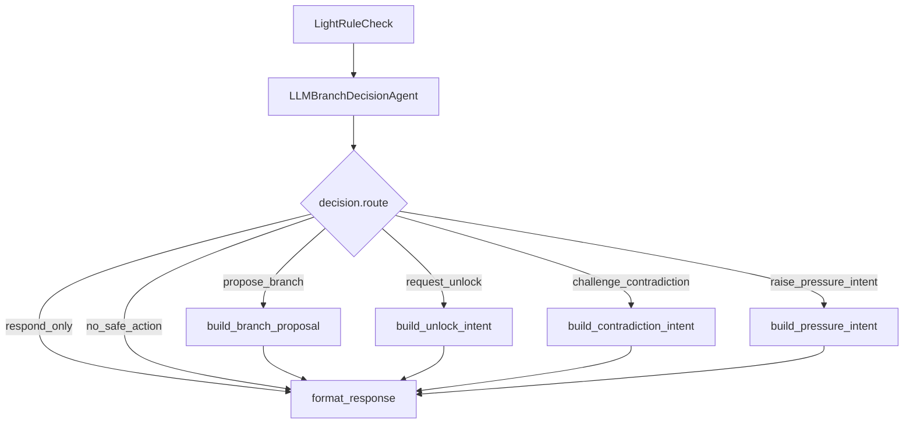

# LLM Branch Owner / Agentic State Direction 제안

## 0. 피드백 재해석

받은 피드백:

> LLM이 대사 생성/문체 보정에만 제한되고, 게임 상태·증거 unlock·판정 등 권위 있는 분기는 백엔드 결정론 정책이 소유한다.

이 피드백은 단순히 “LLM이 말투만 바꾼다”는 지적이 아니라, 평가자가 기대하는 **agentic** 정의가 다음에 가깝다는 뜻으로 해석한다.

1. LLM이 현재 상황을 판단한다.
2. LLM이 다음 분기/행동을 선택한다.
3. 그 선택이 LangGraph 같은 agent graph에서 conditional edge로 드러난다.
4. LLM이 branch owner로 기록된다.
5. Backend는 검증/적용 계층이지만, 모든 분기 판단을 deterministic policy가 선점하지 않는다.

따라서 목표는 다음과 같다.

> LLM을 단순 대사 생성기가 아니라 **수사 분기 판단자 + branch owner + state-transition intent owner**로 올린다.

단, 게임 무결성을 위해 DB write, private truth 노출, 최종 판정 적용은 여전히 안전장치가 필요하다. 핵심은 권한을 둘로 나누는 것이다.

```text
LLM owns decision intent.
BE owns validation and durable application.
```

즉, LLM은 “어떤 분기를 탈지 / 어떤 상태 전이를 요청할지”를 판단한다.  
+BE는 그 판단이 허용 가능한지 검증하고, 통과한 것만 세션 상태에 반영한다.

---

## 1. 최종 방향: A-lite, 그러나 branch proposal을 넘어 conditional decision까지

기존 A-lite를 다음처럼 수정한다.

이 방식은 안전하지만, 평가자 입장에서는 여전히 “LLM은 추천만 하고 실제 분기는 BE가 한다”고 볼 수 있다.

### 수정된 A-lite

```text
LLM이 branch decision을 만든다.
LangGraph conditional edge가 LLM decision에 따라 갈라진다.
LLM decision은 state-transition intent를 포함할 수 있다.
BE는 validator/executor로서 허용된 intent만 적용한다.
FE는 LLM-owned branch와 적용 결과를 함께 보여준다.
```

핵심 차이:

| 구분 | 약한 A-lite | 수정 A-lite |
|---|---|---|
| LLM 역할 | 추천 생성 | 분기 판단 + intent owner |
| Graph | 순차 pipeline | conditional edge 포함 |
| Branch owner | 애매함 | LLM으로 명시 |
| State change | BE deterministic 선점 | LLM intent → BE validation/apply |
| FE 표시 | 추천 카드 | AI 판단 분기 + 검증/적용 상태 |

---

## 2. Agentic 정의

이 프로젝트에서 agentic은 다음을 의미한다.

```text
Agentic = LLM이 공개 상태를 해석하고, 다음 행동/분기/state intent를 선택하며,
그 선택이 graph의 조건부 경로와 세션 진단에 first-class로 남는 것.
```

그러므로 단순히 다음만 하는 것은 agentic이 약하다.

- 대사 생성
- 말투 보정
- safety repair
- deterministic policy가 정한 candidate를 문장으로 표현

반대로 다음이 있으면 agentic으로 보인다.

- LLM decision node
- conditional edge
- branch/state intent schema
- owner/provenance 기록
- accepted/rejected decision diagnostics
- FE에서 “AI 판단 분기”로 표시

---

## 3. 권한 모델

상태 권한을 무조건 BE에만 두면 피드백이 반복될 수 있다.  
반대로 LLM이 DB를 직접 바꾸면 게임 무결성이 깨진다.

따라서 권한을 3단계로 나눈다.

## 3.1 Decision Authority: LLM 소유

LLM이 소유한다.

- 현재 턴에서 어떤 수사 분기로 갈지
- 어떤 증거/진술 조합을 추궁 대상으로 볼지
- follow-up 질문을 할지, 증거 제시를 유도할지, 모순 가설을 만들지
- evidence unlock을 요청할지
- tension 변화 intent를 요청할지
- final accusation readiness를 판단할지

이 레벨에서는 LLM이 owner다.

## 3.2 Validation Authority: BE 소유

BE가 소유한다.

- LLM이 언급한 sourceRefs가 현재 public/unlocked인지
- LLM이 private truth를 노출하지 않았는지
- unlock 요청이 case rule과 precondition을 만족하는지
- contradiction 판정이 required evidence/statement 조건을 만족하는지
- tension change가 중복/반복/비정상 상승이 아닌지
- final verdict가 충분한 public proof 없이 확정되지 않는지

## 3.3 Application Authority: BE 소유

BE가 소유한다.

- DB/session write
- event append
- SSE replay
- idempotency
- transaction boundary
- audit log

정리하면:

```text
LLM decides.
BE validates.
BE applies.
FE renders both the LLM decision and BE result.
```

이 구조는 “LLM이 branch owner가 아니다”라는 지적을 피하면서도, 실제 서비스 안정성은 지킨다.

---

## 4. 새 핵심 모델: LLMDecision

기존 `proposedEvents[]`만으로는 약하다.  
`proposedEvents`는 이벤트 제안처럼 보이고, branch ownership이 약하게 느껴진다.

따라서 LLM output을 다음처럼 확장한다.

```ts
type LLMDecision = {
  decisionId: string;
  owner: "llm_game_master";
  ownerRole: "branch_owner" | "state_intent_owner";

  route:
    | "respond_only"
    | "propose_branch"
    | "request_unlock"
    | "challenge_contradiction"
    | "raise_pressure_intent"
    | "suggest_accusation_readiness"
    | "no_safe_action";

  branchType?:
    | "FOLLOWUP_QUESTION"
    | "EVIDENCE_FOCUS"
    | "STATEMENT_COMPARE"
    | "CONTRADICTION_HYPOTHESIS"
    | "TIMELINE_THREAD"
    | "RELATIONSHIP_OBSERVATION"
    | "ACCUSATION_READINESS";

  stateIntent?: {
    type:
      | "NONE"
      | "UNLOCK_EVIDENCE_REQUESTED"
      | "UNLOCK_STATEMENT_REQUESTED"
      | "CONTRADICTION_CHALLENGE_REQUESTED"
      | "TENSION_CHANGE_REQUESTED"
      | "NOTE_WRITE_REQUESTED"
      | "BOOKMARK_REQUESTED";
    targetIds?: string[];
    suspectId?: string;
    statementIds?: string[];
    evidenceIds?: string[];
    contradictionIds?: string[];
    reasonCode?: string;
  };

  sourceRefs: {
    suspectIds?: string[];
    statementIds?: string[];
    evidenceIds?: string[];
    recordIds?: string[];
    timelineIds?: string[];
    contradictionIds?: string[];
    questionIds?: string[];
  };

  title?: string;
  rationale: string;
  playerFacingText?: string;
  suggestedPrompt?: string;
  confidence: number;
  priority: number;

  safetyClaims: {
    publicOnly: boolean;
    revealAllowed: false;
    doesNotClaimFinalTruth: boolean;
    requiresBEValidation: true;
  };

  provider?: string;
  model?: string;
};
```

중요한 점:

- `stateIntent`가 있으므로 LLM이 상태 전이 판단에 참여한다.
- 하지만 `REQUESTED` 형태이므로 BE validation을 거친다.
- route가 graph conditional edge의 기준이 된다.
- owner/provenance가 있어 LLM branch owner가 명확하다.

---

## 5. LangGraph conditional edge 방향

현재 graph는 사실상 순차 pipeline이다.

```text
load_context
→ validate_scope
→ KnowledgeRetriever
→ DialogueDirectorAgent
→ CharacterAgent
→ DialogueTonePolisher
→ LightRuleCheck
→ GameMasterAgent
→ format_response
```

목표는 `LightRuleCheck` 이후 LLM decision node를 두고 conditional edge를 추가하는 것이다.

```text
LightRuleCheck
→ LLMBranchDecisionAgent
→ conditional edge
   ├─ respond_only                  → format_response
   ├─ propose_branch                → build_branch_proposal → format_response
   ├─ request_unlock                → build_state_intent    → format_response
   ├─ challenge_contradiction       → build_contradiction_intent → format_response
   ├─ raise_pressure_intent         → build_pressure_intent → format_response
   └─ no_safe_action                → format_response
```

Mermaid:



## 5.1 왜 conditional edge가 중요하나

평가자가 보는 agentic 포인트는 다음이다.

- LLM이 단일 응답만 생성하지 않는다.
- LLM output이 다음 graph route를 결정한다.
- route에 따라 후속 node가 달라진다.
- 이 route가 diagnostics와 FE에 남는다.

따라서 `LangGraph add_conditional_edges` 또는 이에 준하는 자체 conditional runner가 필요하다.

---

## 6. Backend 수정 방향

## 6.1 최소 수정 원칙

프론트/백을 모두 고려하되, 처음부터 대공사를 하지 않는다.

우선순위:

1. AI graph에 LLM decision node 추가
2. response schema에 `llmDecision` 추가
3. DialogueService에서 LLM decision intent를 BE validator에 전달
4. BE가 accepted/rejected decision result를 public diagnostics에 남김
5. FE가 그 결과를 작은 패널로 렌더링

처음부터 별도 DB table, 별도 branch aggregate, 대형 UI를 만들지 않는다.

## 6.2 AI graph

수정 대상:

- `BE/app/ai_engine/graph/dialogue_graph.py`
- `BE/app/ai_engine/graph/common.py`
- `BE/app/ai_engine/schemas/agents.py`
- `BE/app/ai_engine/application/game_master_agent.py` 또는 새 `branch_decision_agent.py`

### 방향

1. `LLMBranchDecisionAgent` 추가
2. `CheckedCharacterReply`, `allowedEventPolicy`, `turnInterpretation`, `interrogationTransition`, `visibleFacts`를 입력으로 받음
3. strict JSON으로 `LLMDecision` 생성
4. decision.route 기준으로 conditional node 실행
5. `DialogueResponse.runtimeDiagnostics.llmDecision`에 기록

### common runner 방향

현재 `run_langgraph_or_pipeline()`는 순차 edge만 추가한다.  
수정 방향은 두 가지다.

#### Option 1: 실제 LangGraph conditional edge 사용

```py
graph.add_conditional_edges(
    "LLMBranchDecisionAgent",
    route_from_llm_decision,
    {
        "respond_only": "format_response",
        "propose_branch": "build_branch_proposal",
        "request_unlock": "build_unlock_intent",
        "challenge_contradiction": "build_contradiction_intent",
        "raise_pressure_intent": "build_pressure_intent",
        "no_safe_action": "format_response",
    },
)
```

#### Option 2: fallback-safe 자체 conditional runner

LangGraph import 실패 시에도 route가 유지되어야 하므로 pipeline fallback에서도 조건 분기를 흉내낸다.

```py
state.update(llm_branch_decision(state))
route = state["llm_decision"].route
if route == "propose_branch":
    state.update(build_branch_proposal(state))
elif route == "request_unlock":
    state.update(build_unlock_intent(state))
elif route == "challenge_contradiction":
    state.update(build_contradiction_intent(state))
elif route == "raise_pressure_intent":
    state.update(build_pressure_intent(state))
state.update(format_response(state))
```

초기 구현은 Option 2로도 충분하다.  
하지만 문서/진단에는 “conditional route selected by LLM”이 남아야 한다.

## 6.3 DialogueResponse schema

추가:

```py
class DialogueResponse(FlexibleModel):
    ...
    llmDecision: LLMDecision | None = None
    llmDecisionRoute: str | None = None
    branchProposals: list[AgentBranchProposal] = Field(default_factory=list)
    stateIntents: list[LLMStateIntent] = Field(default_factory=list)
```

또는 호환성을 위해 runtimeDiagnostics에 먼저 넣어도 된다.

```json
"runtimeDiagnostics": {
  "llmDecision": {
    "owner": "llm_game_master",
    "route": "challenge_contradiction",
    "stateIntent": {
      "type": "CONTRADICTION_CHALLENGE_REQUESTED"
    },
    "confidence": 0.81,
    "acceptedByBE": true,
    "rejectedReason": null
  }
}
```

## 6.4 DialogueService

현재 DialogueService가 deterministic하게 먼저 contradiction을 judge하는 부분이 있다.  
이 구조는 “BE가 분기를 선점한다”는 인상을 준다.

수정 방향:

### 현재 느낌

```text
BE classify
→ BE judge contradiction
→ BE transition
→ AI answer/proposedEvents
```

### 목표 느낌

```text
BE prepares public context
→ AI decides route/stateIntent
→ BE validates stateIntent
→ BE applies accepted state transition
```

실제 리스크를 줄이기 위해 단계적으로 간다.

### Phase 1: 병렬 기록

- 기존 BE judge는 유지한다.
- LLMDecision도 생성한다.
- 두 결과를 비교해서 diagnostics에 남긴다.

```json
"decisionComparison": {
  "llmRoute": "challenge_contradiction",
  "beDetectedContradiction": true,
  "aligned": true
}
```

이것만으로도 평가자에게 “LLM이 판단했다”는 증거가 된다.

### Phase 2: LLM intent 우선

- contradiction/tension/unlock 처리를 LLM stateIntent 기반으로 요청한다.
- BE는 validator로만 reject/accept한다.
- deterministic detector는 fallback 또는 validator helper로 내려간다.

```text
LLM stateIntent: CONTRADICTION_CHALLENGE_REQUESTED
→ BE RuleEngine validates exact statement/evidence requirements
→ accepted면 discoveredContradictionIds/tension/events 적용
```

### Phase 3: 일부 unlock intent 허용

- LLM이 `UNLOCK_EVIDENCE_REQUESTED`를 낼 수 있다.
- BE는 case rule precondition을 확인한다.
- precondition 만족 시 unlock 적용.

이렇게 하면 “게임 상태·증거 unlock·판정 등 권위 있는 분기에 LLM이 판단자로 참여한다”는 요구를 반영할 수 있다.

## 6.5 EventProcessor / RuleEngine

EventProcessor는 LLM output을 바로 적용하지 말고 intent validation layer를 추가한다.

```text
LLMDecision.stateIntent
→ StateIntentValidator
→ RuleEngine
→ EventProcessor
```

새 validator 책임:

- source refs visible check
- target IDs allowed check
- private leak check
- duplicate/idempotency check
- rule precondition check
- accepted/rejected result 생성

중요:

> RuleEngine은 LLM을 대체하지 않는다.  
> RuleEngine은 LLM decision의 judge/executor가 된다.

이 표현이 중요하다. 평가자에게 “BE가 다 결정한다”가 아니라 “LLM이 결정했고 BE가 검증했다”로 보인다.

---

## 7. Frontend 수정 방향

FE도 같이 바뀌어야 한다.  
BE/AI만 바꿔도 화면에서 안 보이면 평가자는 agentic을 못 느낀다.

## 7.1 최소 UI

새 큰 화면이 아니라 기존 조사 화면 한쪽에 작은 패널을 둔다.

```text
AI 판단 분기
────────────────
이번 턴 판단: 모순 추궁 분기
근거: 한서연 22시 진술 + 서재 출입 기록
AI 판단: 이 조합은 모순 추궁으로 이어질 가능성이 높습니다.
BE 검증: 통과 / 아직 확정 아님

[질문 초안 채우기] [관련 증거 보기] [진술 선택]
```

## 7.2 표시해야 할 필드

FE는 다음을 보여준다.

- `owner: llm_game_master`
- `route`
- `branchType`
- `rationale`
- `confidence`
- `acceptedByBE` / `rejectedReason`
- related evidence/statement links
- suggestedPrompt

## 7.3 UX 문구

권장 문구:

```text
AI 판단 분기
LLM이 현재 공개 근거를 바탕으로 선택한 다음 수사 경로입니다.
BE 검증을 통과한 항목만 표시됩니다.
```

상태별 라벨:

```text
AI 판단 · BE 검증 통과 · 아직 확정 아님
AI 판단 · BE 검증 거절 · 공개 근거 부족
AI 판단 · 대기 중 · 플레이어 선택 필요
```

## 7.4 CTA

branch/state intent가 실제 플레이어 행동으로 이어져야 한다.

- `suggestedPrompt` → 질문 입력창에 채우기
- `statementIds` → 진술 선택 상태로 반영
- `evidenceIds` → 증거 선택/하이라이트
- `CONTRADICTION_CHALLENGE_REQUESTED` → 모순 조합 UI 열기
- `ACCUSATION_READINESS` → 고발 drawer 열기

이렇게 해야 “LLM이 분기만 말하고 끝”이 아니라, 플레이어 액션 루프로 이어진다.

---

## 8. Backend/Frontend 계약

## 8.1 Dialogue response 추가 예시

```json
{
  "answer": "그 기록 하나로 저를 몰아붙이긴 어렵습니다. 그래도 제 말과 맞지 않는 부분이 있다는 건 알겠어요.",
  "dialogueResult": {
    "llmDecision": {
      "decisionId": "dec_000123",
      "owner": "llm_game_master",
      "ownerRole": "state_intent_owner",
      "route": "challenge_contradiction",
      "branchType": "CONTRADICTION_HYPOTHESIS",
      "stateIntent": {
        "type": "CONTRADICTION_CHALLENGE_REQUESTED",
        "suspectId": "char_hanseoyeon",
        "statementIds": ["st_hanseoyeon_room_2200"],
        "evidenceIds": ["ev_study_entry_log"],
        "reasonCode": "same_time_location_conflict"
      },
      "rationale": "한서연의 22시 방 진술과 서재 출입 기록이 같은 시간대를 두고 충돌할 가능성이 있습니다.",
      "playerFacingText": "22시 방 알리바이를 서재 출입 기록과 비교해보세요.",
      "suggestedPrompt": "22시에는 방에 있었다고 했는데, 서재 출입 기록은 어떻게 설명하실 건가요?",
      "confidence": 0.84,
      "provider": "openai",
      "model": "configured-model"
    },
    "llmDecisionValidation": {
      "accepted": true,
      "appliedStateIntent": false,
      "reason": "candidate_visible_but_player_confirmation_required"
    }
  }
}
```

## 8.2 Session payload read model

세션에는 최근 AI 판단 분기를 넣는다.

```json
{
  "agentBranches": {
    "latest": {
      "decisionId": "dec_000123",
      "owner": "llm_game_master",
      "route": "challenge_contradiction",
      "title": "22시 방 알리바이와 서재 출입 기록 비교",
      "status": "pending_player_action",
      "acceptedByBE": true
    },
    "recent": []
  }
}
```

초기에는 DB schema를 크게 바꾸지 않고 `session.lastRuntimeDiagnostics` 또는 event payload에서 시작해도 된다.  
다만 FE가 보기 쉽게 adapter에서 `agentBranches` 형태로 normalize한다.

---

## 9. 구현 단계

## Phase 0: 문서/계약 정리

- `LLMDecision` schema 정의
- `stateIntent` 종류 정의
- FE 표시 필드 정의
- accepted/rejected reason 정의

## Phase 1: 관찰형 LLM branch owner

목표: BE deterministic flow는 유지하되, LLM이 같은 턴에서 독립 판단을 내리고 그 route가 기록된다.

작업:

1. `LLMBranchDecisionAgent` 추가
2. `DialogueResponse.runtimeDiagnostics.llmDecision` 추가
3. LangGraph/pipeline에 decision route 기록
4. FE에 “AI 판단 분기” 패널 표시
5. BE 판단과 LLM 판단 alignment diagnostics 추가

장점:

- 리스크 낮음
- FE/BE 수정 적음
- 평가자에게 LLM 판단/분기 evidence를 보여줄 수 있음

한계:

- 실제 state application은 아직 BE 선점처럼 보일 수 있음

## Phase 2: LLM intent 기반 state transition

목표: LLM이 state transition intent를 소유하고, BE는 검증 후 적용한다.

작업:

1. `stateIntent`를 DialogueService로 전달
2. `StateIntentValidator` 추가
3. contradiction/tension/note/bookmark 일부를 LLM intent 기반으로 처리
4. deterministic detection은 fallback/helper로 격하
5. FE에 `acceptedByBE`, `appliedStateIntent` 표시

이 단계부터는 “LLM이 게임 상태 분기를 판단한다”고 말할 수 있다.

## Phase 3: unlock intent 일부 허용

목표: LLM이 evidence/statement unlock 요청도 할 수 있게 한다.

작업:

1. `UNLOCK_EVIDENCE_REQUESTED`, `UNLOCK_STATEMENT_REQUESTED` 지원
2. BE precondition validator 추가
3. accepted unlock은 기존 EventProcessor로 적용
4. rejected unlock은 diagnostics에 남김

주의:

- LLM이 private solution을 알아서 unlock하면 안 된다.
- unlock 가능한 후보 universe는 BE가 public/precondition-safe하게 제한해서 줘야 한다.

---

## 10. 역할별 영향도

## 10.1 CharacterAgent

변경 최소.

현재처럼 용의자 답변 생성 담당.  
수사 분기 판단은 하지 않는다.

## 10.2 LightRuleCheck

변경 최소.

현재처럼 답변 safety/quality 담당.  
다만 LLMDecision 생성 전 gate로 사용된다.

```text
if checked reply unsafe:
  route = no_safe_action
```

## 10.3 GameMasterAgent / LLMBranchDecisionAgent

가장 중요한 변경 지점.

역할을 다음처럼 강화한다.

기존:

```text
대화 후 proposedEvents 생성
```

변경:

```text
대화 후 현재 공개 상태를 판단하고 route/stateIntent/branch를 선택
```

이 agent가 branch owner다.

## 10.4 RuleEngine

역할이 바뀐다.

기존 인상:

```text
RuleEngine이 분기 판단 주체
```

목표 인상:

```text
LLM이 분기 판단
RuleEngine은 LLM intent 검증/적용 도구
```

## 10.5 EventProcessor

역할 유지.

- accepted intent를 event로 저장
- rejected intent를 diagnostics/log로 남김
- SSE replay 보장

## 10.6 FE

작은 패널 추가.

- AI 판단 분기 표시
- BE 검증 상태 표시
- suggestedPrompt CTA
- related refs highlight

---

## 11. 평가자 관점 대응 문장

제품 설명은 다음처럼 한다.

> 기존에는 LLM이 용의자 대사 생성에 집중했고, 사건 진행 분기는 Backend RuleEngine이 결정했습니다.  
> 개선 방향에서는 LLM을 LangGraph의 branch decision node로 승격합니다.  
> LLM이 현재 공개 증거와 진술을 해석해 `respond_only`, `propose_branch`, `challenge_contradiction`, `request_unlock` 같은 route를 선택하고, 이 route가 conditional edge를 통해 후속 node를 결정합니다.  
> Backend는 LLM의 state-transition intent를 검증하고 적용하는 executor/guard 역할을 맡습니다.  
> 따라서 LLM은 branch owner이고, BE는 state integrity owner입니다.

짧은 버전:

```text
LLM decides the branch.
LangGraph follows the conditional edge.
BE validates and applies the state transition.
FE shows the LLM-owned branch and validation result.
```

---

## 12. Acceptance Criteria

## 12.1 Agentic graph

- [ ] LLM decision node가 있다.
- [ ] LLM decision에 `route`가 있다.
- [ ] route가 conditional edge 또는 equivalent conditional runner를 탄다.
- [ ] route가 diagnostics에 남는다.
- [ ] provider/model/confidence가 남는다.

## 12.2 Branch owner

- [ ] branch payload에 `owner: "llm_game_master"`가 있다.
- [ ] LLM이 branch type/rationale/suggestedPrompt를 생성한다.
- [ ] BE deterministic policy가 branch text를 전부 선점하지 않는다.
- [ ] FE에 “AI 판단 분기”로 표시된다.

## 12.3 State intent

- [ ] LLMDecision에 `stateIntent`가 있다.
- [ ] BE가 stateIntent를 accepted/rejected한다.
- [ ] accepted/rejected reason이 public diagnostics에 남는다.
- [ ] contradiction/tension/note/bookmark 중 최소 하나는 LLM intent 기반으로 처리된다.

## 12.4 Safety

- [ ] private refs는 reject된다.
- [ ] invisible refs는 reject된다.
- [ ] provider degraded면 stateIntent apply가 차단된다.
- [ ] BE validation 없이 DB/session mutation이 일어나지 않는다.
- [ ] replay/idempotency가 유지된다.

## 12.5 FE

- [ ] 최신 LLM decision route가 화면에 보인다.
- [ ] BE 검증 상태가 보인다.
- [ ] suggestedPrompt를 질문 입력창에 넣을 수 있다.
- [ ] related evidence/statement가 하이라이트된다.
- [ ] rejected decision도 debug/diagnostic으로 확인 가능하다.

---

## 13. 최소 구현으로 보이는 결과

가장 작은 데모는 다음이면 된다.

1. 플레이어가 증거를 언급하며 용의자를 압박한다.
2. LLMBranchDecisionAgent가 `route=challenge_contradiction`을 선택한다.
3. LangGraph conditional edge가 contradiction intent node로 간다.
4. LLMDecision에 statement/evidence refs와 rationale이 담긴다.
5. BE가 refs visible 여부와 rule precondition을 검증한다.
6. FE가 “AI 판단 분기: 모순 추궁” 카드를 보여준다.
7. 플레이어가 CTA를 눌러 질문 초안을 채우거나 모순 조합 UI로 이동한다.
8. 최종 확정은 BE가 하지만, 분기 선택자는 LLM으로 기록된다.

이 정도면 “LLM이 대사/문체에만 제한된다”는 평가는 피할 수 있다.

---

## 14. 최종 권장 방향

최종적으로는 다음 구조가 가장 적절하다.

```text
CharacterAgent
  - 답변 생성

LightRuleCheck
  - 답변 안전성 검증

LLMBranchDecisionAgent / GameMasterAgent
  - 현재 턴 판단
  - conditional route 선택
  - branch owner
  - state-transition intent owner

BE StateIntentValidator / RuleEngine
  - LLM intent 검증
  - rule precondition 확인
  - accepted transition 적용

EventProcessor
  - event persistence/SSE

FE
  - LLM 판단 분기와 BE 검증 결과 표시
  - 플레이어 action으로 연결
```

한 줄 결론:

> A-lite로 시작하되, 단순 suggestion이 아니라 **LLM conditional decision + stateIntent + FE-visible branch ownership**까지 포함해야 한다.


---

## 15. 기존 방식과 변경 후 방식의 차이

이 섹션은 실제 플레이 경험, UI, 에이전트 흐름이 어떻게 달라지는지 설명한다.

## 15.1 기존 플레이 흐름

기존 방식은 자연어 심문 중심이었다.

```text
플레이어가 용의자에게 자연어 질문
→ BE가 질문/증거/모순 여부를 deterministic하게 해석
→ LLM이 용의자 답변 생성/문체 보정
→ BE가 unlock/모순/tension/최종 판정 적용
→ FE가 대화, 증거, 노트, 긴장도, 최종 고발 UI를 표시
```

기존 UI 중심 요소:

- 자연어 대화창
- 용의자 선택
- 증거 패널
- 노트/수첩
- 긴장도/표정 변화
- 최종 고발 drawer

기존 구조의 체감:

> 플레이어가 직접 질문하고, BE 룰엔진이 맞는지 판정하며, LLM은 용의자처럼 자연스럽게 말한다.

문제는 평가자 입장에서 다음처럼 보일 수 있다는 점이다.

```text
LLM = 대사 생성 / 문체 보정
BE = 실제 게임 분기와 상태 판단
```

즉, LLM이 agent라기보다 NPC dialogue generator처럼 보인다.

## 15.2 변경 후 플레이 흐름

변경 후에도 자연어 심문, 증거, 긴장도, 최종 고발은 유지한다.  
다만 그 위에 **AI 판단 분기 레이어**가 추가된다.

```text
플레이어 입력
→ BE가 공개 context 준비
→ CharacterAgent가 대사 생성
→ LightRuleCheck가 안전 검증
→ LLMBranchDecisionAgent / GameMasterAgent가 판단
→ LangGraph conditional edge 선택
   ├─ respond_only
   ├─ propose_branch
   ├─ challenge_contradiction
   ├─ request_unlock
   └─ raise_pressure_intent
→ BE가 LLM intent 검증
→ 통과한 것만 state/event 반영
→ FE가 AI 판단 + BE 검증 결과 표시
```

변경 후 체감:

> 플레이어가 질문하면 AI GameMaster가 현재 수사 흐름을 해석하고, 다음 분기 또는 상태 전이 intent를 선택한다. BE는 그 intent를 검증하고 적용한다.

즉, 플레이어 경험은 다음처럼 바뀐다.

```text
기존: 플레이어 주도 심문 + BE 판정 + LLM 대사 생성
변경: 플레이어 심문 + LLM 수사 분기 판단 + BE 검증/적용 + FE에서 AI 판단 흐름 표시
```

## 15.3 UI 차이

### 기존 UI

```text
대화 결과
증거 목록
긴장도
노트
최종 고발
```

### 변경 후 UI

```text
대화 결과
증거 목록
긴장도
노트
최종 고발
+ AI 판단 분기
+ LLM이 선택한 route
+ LLM이 본 공개 근거
+ BE 검증 결과
+ 다음 행동 CTA
```

예시 UI:

```text
AI 판단 분기
────────────────
이번 턴 판단: 모순 추궁 분기
Route: challenge_contradiction
근거: 한서연 22시 방 진술 + 서재 출입 기록
AI 판단: 이 조합은 알리바이 충돌 가능성이 높습니다.
BE 검증: 공개 근거 확인됨 / 아직 확정 아님

추천 행동:
“22시에는 방에 있었다고 했는데, 서재 출입 기록은 어떻게 설명하실 건가요?”

[질문 초안 채우기] [관련 증거 보기] [진술 선택]
```

UI에서 중요한 점은 “AI가 판단했다”와 “BE가 검증했다”를 동시에 보여주는 것이다.

권장 라벨:

```text
AI 판단 · BE 검증 통과 · 아직 확정 아님
AI 판단 · BE 검증 거절 · 공개 근거 부족
AI 판단 · 대기 중 · 플레이어 선택 필요
```

## 15.4 에이전트 흐름 차이

### 기존 에이전트 흐름

```text
BE deterministic classification/judgement
→ CharacterAgent
→ DialogueTonePolisher
→ LightRuleCheck
→ GameMasterAgent proposedEvents
→ BE EventProcessor
```

이 구조에서는 LLM이 “분기 선택자”라기보다는 “BE가 정한 안전 범위 안에서 말하는 생성기”처럼 보인다.

### 변경 후 에이전트 흐름

```text
BE public context builder
→ CharacterAgent
→ LightRuleCheck
→ LLMBranchDecisionAgent / GameMasterAgent
→ conditional route
→ route-specific intent builder
→ BE StateIntentValidator
→ BE RuleEngine/EventProcessor apply
```

핵심 차이:

| 영역 | 기존 | 변경 후 |
|---|---|---|
| LLM | 대사 생성/보정 중심 | 분기 판단 + route 선택 + stateIntent 생성 |
| BE | 먼저 판단하고 LLM에 범위 제공 | public context 제공 후 LLM intent 검증/적용 |
| LangGraph | 순차 pipeline | conditional edge 포함 |
| FE | 결과 표시 중심 | AI 판단 분기와 BE 검증 결과 표시 |
| 긴장도 | BE가 모순 감지 후 상승 | LLM이 pressure/contradiction intent 요청, BE 검증 후 상승 |
| unlock | BE question/rule 기반 | LLM unlock intent 요청 가능, BE precondition 검증 후 적용 |

## 15.5 긴장도 변화의 의미 변화

### 기존

```text
BE가 모순 감지
→ 긴장도 상승
→ UI 반영
```

### 변경 후

```text
LLM이 “이 턴은 압박/모순 추궁 분기”라고 판단
→ stateIntent: TENSION_CHANGE_REQUESTED 또는 CONTRADICTION_CHALLENGE_REQUESTED
→ BE가 공개 증거/진술 조건 검증
→ 통과하면 긴장도 상승
→ FE에 “AI 판단 → BE 검증 통과” 표시
```

따라서 같은 긴장도 변화라도 의미가 달라진다.

기존:

> 룰엔진이 올렸다.

변경 후:

> LLM이 이 상황을 압박 분기로 판단했고, BE가 검증해서 적용했다.

## 15.6 유지되는 것

변경 후에도 유지해야 하는 것:

- 자연어 심문
- 용의자별 대화/성격/말투
- 긴장도/표정 변화
- 증거/진술/노트 기반 추리
- 최종 범인 고발
- BE 검증 없는 DB/session mutation 금지
- private truth 직접 노출 금지

즉, 기존 게임을 버리는 것이 아니라 다음 레이어를 추가한다.

```text
기존 자연어 심문 게임
+ LLM conditional decision layer
+ FE-visible AI branch ownership
+ BE validation/application layer
```

---

## 16. Conditional edge별 의미

이 섹션은 `LLMDecision.route`가 각각 어떤 역할을 하는지 정의한다.  
중요한 점은 route 자체를 LLM이 선택한다는 것이다.

```text
LLMDecision.route
├─ respond_only
├─ propose_branch
├─ challenge_contradiction
├─ request_unlock
├─ raise_pressure_intent
└─ no_safe_action
```

## 16.1 `respond_only`

### 의미

LLM이 이번 턴을 단순 응답 턴으로 판단한 경우다.

예:

- 인사
- 잡담
- 사건과 관련 낮은 질문
- 새 증거/진술/모순으로 이어지지 않는 확인 질문

### LLM 책임

- 별도 branch/stateIntent를 만들지 않는다.
- 용의자 답변만 유지한다.
- 필요하면 “현재는 수사 분기로 볼 근거 부족” rationale을 남긴다.

### BE 처리

- 상태 변경 없음
- unlock 없음
- tension 상승 없음
- note/branch event 없음 또는 diagnostic만 기록

### FE 표시

```text
AI 판단: 일반 응답
BE 검증: 상태 변화 없음
```

## 16.2 `propose_branch`

### 의미

LLM이 현재 공개 정보에서 다음 수사 방향을 제안할 수 있다고 판단한 경우다.  
아직 unlock/모순/tension을 바로 요청하지 않고, 플레이어가 따라갈 branch를 만든다.

예:

- “이 증거를 박도윤에게 제시해보라.”
- “한서연의 22시 진술과 서재 출입 기록을 비교해보라.”
- “상속 동기 관련 기록을 더 확인해보라.”

### LLM 책임

- branchType 선택
- sourceRefs 선택
- rationale 작성
- suggestedPrompt 작성
- priority/confidence 산정

### BE 처리

- sourceRefs visible/unlocked 검증
- private leak 검증
- suggestedAction 가능 여부 검증
- accepted branch를 public diagnostics/session read model에 반영

### FE 표시

```text
AI 판단 분기: 다음 추궁 후보
근거: visible evidence + statement
CTA: 질문 초안 채우기 / 관련 증거 보기 / 진술 선택
```

## 16.3 `challenge_contradiction`

### 의미

LLM이 플레이어 입력 또는 현재 공개 근거가 모순 추궁으로 이어질 수 있다고 판단한 경우다.

예:

- 용의자의 알리바이 진술과 출입 기록이 충돌
- 증거의 시간대와 진술 시간이 맞지 않음
- 공개 statement/evidence 조합이 contradiction candidate와 맞물림

### LLM 책임

- `stateIntent.type = CONTRADICTION_CHALLENGE_REQUESTED`
- suspectId, statementIds, evidenceIds, contradictionIds 후보 제시
- 왜 모순으로 볼 수 있는지 rationale 작성
- 필요하면 suggestedPrompt 작성

### BE 처리

- statement/evidence가 현재 visible/unlocked인지 검증
- 해당 조합이 case contradiction rule과 맞는지 검증
- 바로 확정 가능한 경우 contradiction result 적용
- 플레이어 확인이 필요한 경우 candidate 상태로 유지
- 중복 발견이면 pressure 중복 상승 방지

### FE 표시

```text
AI 판단 분기: 모순 추궁
BE 검증: 후보 확인됨 / 확정됨 / 근거 부족
CTA: 모순 조합 제출 / 관련 진술 선택 / 관련 증거 보기
```

### 중요한 차이

기존에는 BE가 모순을 먼저 감지했다.  
변경 후에는 LLM이 모순 추궁 route를 선택하고, BE가 rule로 검증한다.

```text
LLM = contradiction branch owner
BE = contradiction verifier/applicator
```

## 16.4 `request_unlock`

### 의미

LLM이 현재 대화/근거상 새로운 evidence/statement/record/timeline을 공개 요청할 만하다고 판단한 경우다.

예:

- 특정 질문 답변 뒤 관련 진술 공개 요청
- 대화에서 언급된 공개 가능한 증거 detail unlock 요청
- timeline thread 공개 요청

### LLM 책임

- `stateIntent.type = UNLOCK_EVIDENCE_REQUESTED` 또는 `UNLOCK_STATEMENT_REQUESTED`
- targetIds 제시
- 왜 지금 unlock되어야 하는지 public rationale 작성
- unlock이 final truth라고 주장하지 않음

### BE 처리

- targetIds가 현재 case rule상 unlock 가능한 후보인지 검증
- precondition 만족 여부 확인
- private-only item이면 reject
- accepted면 기존 unlock/event path로 적용
- rejected면 reason 기록

### FE 표시

```text
AI 판단: 새 단서 공개 요청
BE 검증: 공개 조건 충족 / 조건 부족 / 비공개 단서라 거절
```

### 주의

이 route는 agentic 체감이 크지만 리스크도 크다.  
따라서 Phase 3에서 제한적으로 허용한다.

## 16.5 `raise_pressure_intent`

### 의미

LLM이 이번 턴이 용의자를 압박하는 심리적 전환이라고 판단한 경우다.

예:

- 플레이어가 같은 진술을 반복 압박
- 공개 증거를 직접 들이밀며 추궁
- 용의자의 이전 답변과 현재 질문이 충돌감을 형성

### LLM 책임

- `stateIntent.type = TENSION_CHANGE_REQUESTED`
- suspectId, evidenceIds/statementIds 근거 제시
- pressure 상승 이유를 public rationale로 작성
- 수치 자체를 확정하기보다 pressure intent를 요청

### BE 처리

- 실제 pressureDelta 산정
- 중복 상승 방지
- small talk/unmatched에서는 reject
- contradiction 검증 없이 과도한 상승 방지
- accepted면 `TENSION_CHANGED` event 적용

### FE 표시

```text
AI 판단: 압박 상승 요청
BE 검증: 긴장도 상승 적용 / 중복 압박이라 변화 없음 / 근거 부족
```

### 중요한 차이

기존에는 BE tension policy가 전부 판단했다.  
변경 후에는 LLM이 “이 턴은 압박이다”라고 판단하고, BE가 적용 가능성을 검증한다.

## 16.6 `no_safe_action`

### 의미

LLM 또는 guard가 이번 턴에서 안전한 branch/stateIntent를 만들 수 없다고 판단한 경우다.

예:

- provider degraded
- LightRuleCheck에서 private leak 위험
- 질문이 private truth를 직접 요구
- sourceRefs가 불명확
- hallucination 위험이 높음

### LLM 책임

- stateIntent 없음
- safe fallback rationale 제공
- branch 생성하지 않음

### BE 처리

- 상태 변경 없음
- unlock 없음
- tension 없음
- rejected diagnostics 기록

### FE 표시

```text
AI 판단: 안전한 분기 없음
이유: 공개 근거 부족 / provider degraded / private 요청 차단
```

---

## 17. Route별 BE/FE 처리 요약

| route | LLM 판단 | BE 검증/적용 | FE 표시 |
|---|---|---|---|
| `respond_only` | 일반 응답 | 상태 변화 없음 | 일반 응답 |
| `propose_branch` | 다음 수사 방향 제안 | refs/action 검증 | AI 판단 분기 카드 |
| `challenge_contradiction` | 모순 추궁 판단 | RuleEngine으로 조합 검증 | 모순 추궁 카드/CTA |
| `request_unlock` | unlock 요청 판단 | precondition 검증 후 unlock | 새 단서 요청 결과 |
| `raise_pressure_intent` | 압박 상승 판단 | tension policy 적용 | 긴장도 판단 결과 |
| `no_safe_action` | 안전한 분기 없음 | 상태 변화 차단 | 차단/진단 표시 |

---

## 18. 핵심 변화 한 줄 정리

기존:

```text
플레이어가 자연어로 심문하고, BE가 분기를 판단하고, LLM은 용의자 대사를 만든다.
```

변경:

```text
플레이어가 자연어로 심문하면, LLM이 현재 턴의 수사 route/stateIntent를 판단하고,
LangGraph conditional edge가 그 판단을 따른 뒤, BE가 검증하여 적용하고,
FE가 AI 판단과 BE 검증 결과를 함께 보여준다.
```
